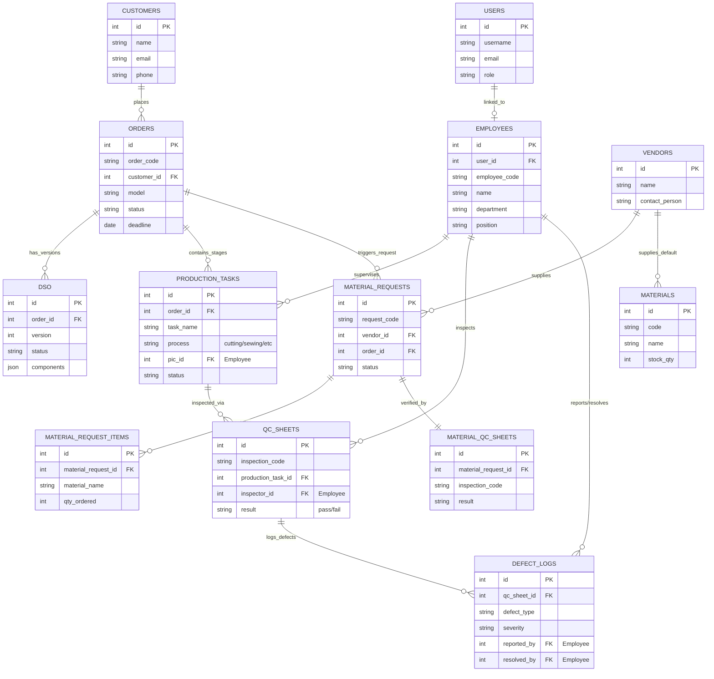

# Entity Relationship Diagram (ERD) - Green Productions

The following diagram illustrates the relationship between the core database tables in the Green Productions system.

## Legend

*   **PK**: Primary Key
*   **FK**: Foreign Key
*   **||--o{**: One-to-Many Relationship
*   **||--||**: One-to-One Relationship
*   **||--o|**: One-to-Zero/One Relationship
